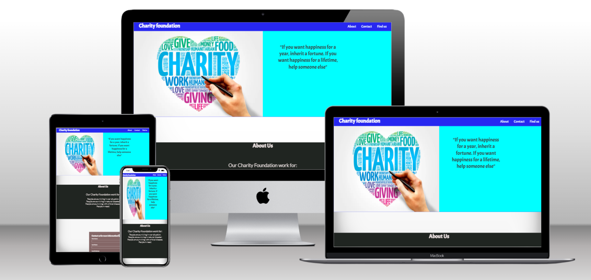
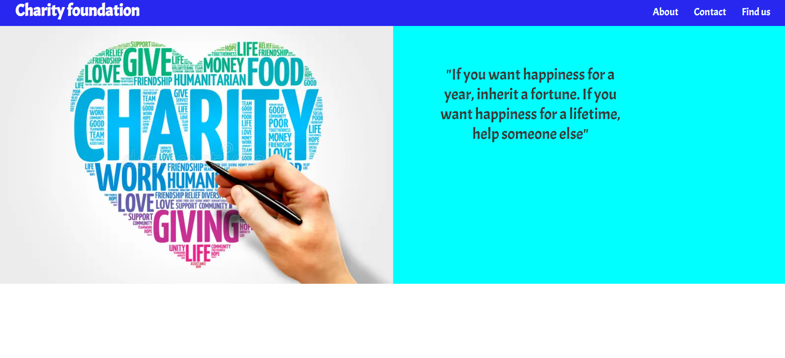
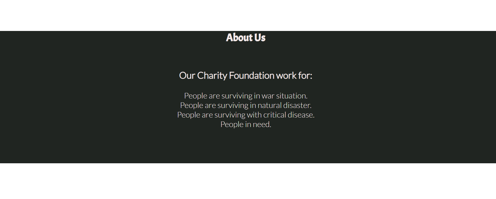
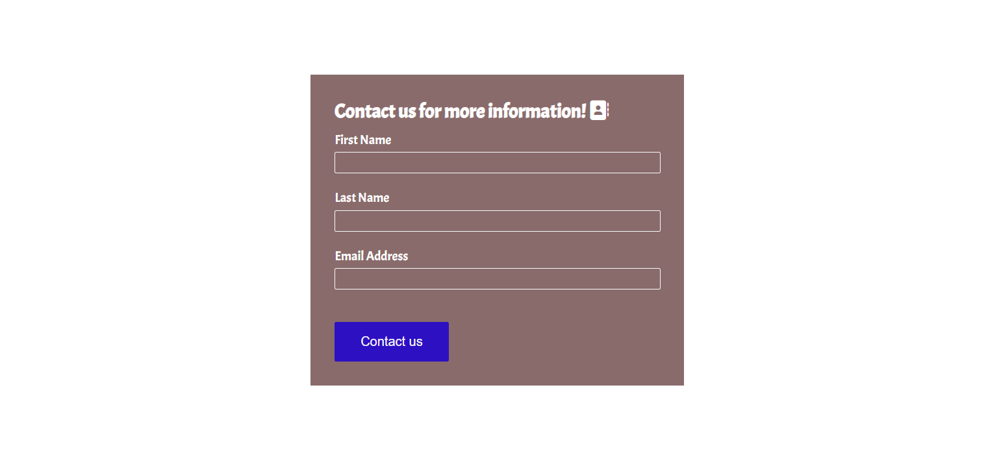
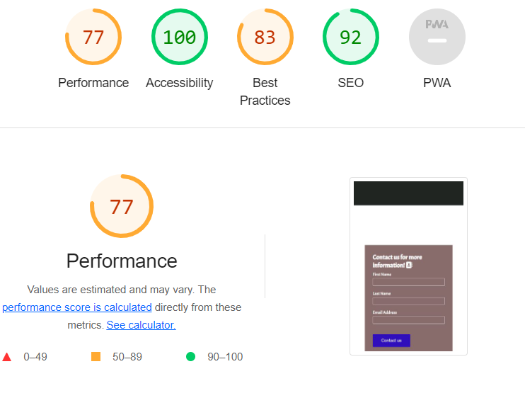

# Portfolio Project1 Charity foundation

## First page and viewport for different devices

### The main structure is based on inspirational espressiones. It is a small website, formed by four section; on the top there are three icons bar to navigate each section and scrolling bar to navigate. The title is "Charity foundation". It is made to give basic knowlage about the foundation and let contact the group.

## Representation of first section

First section contain;

1. A picture to inspire for donation"

2. A positive quote.

3. Navigation bar. There are three navigation bar

             1. About us, on click it will represent the about us section.
             2. Contact us, on click it will represent the form to contact.
             3. Find us, four different website to choose.

## Representation of second section

Second section contain;

1. A brief description about the foundation

## Third section

1. This is a contact page where all of three element required;

## Last section is footer

There are four links to navigate and find us.

# Validator Testing

1. HTML
   No errors were returned when passing through the official W3C validator.

2. CSS
   No errors were found when passing through the official (Jigsaw) validator.

3. Accessibility

# deployment

The live link can be found here -

# content

The content has taken from portafolio project 1 example.

# Media

The picture used on the home page is taken from this Open Source site;

1. I couldn't find all images but first page image website link; (<https://www.google.com/search?q=charity+foundation&tbm=isch&hl=en&chips=q:charity+foundation>,g_1:banner:0OSgopOzdkk%3D,online_chips:charity+poster:jGbU8PH2pfc%3D,online_chips:voluntary+work:Tj_YE9LYT9w%3D,online_chips:illustration:ttp7mrtd4R4%3D&sa=X&ved=2ahUKEwjzj66YreiAAxUO2SoKHZZDDQsQ4lYoBnoECAEQSQ&biw=1519&bih=707)

2. quote has taken from; <https://www.azquotes.com/quote/1339922>
